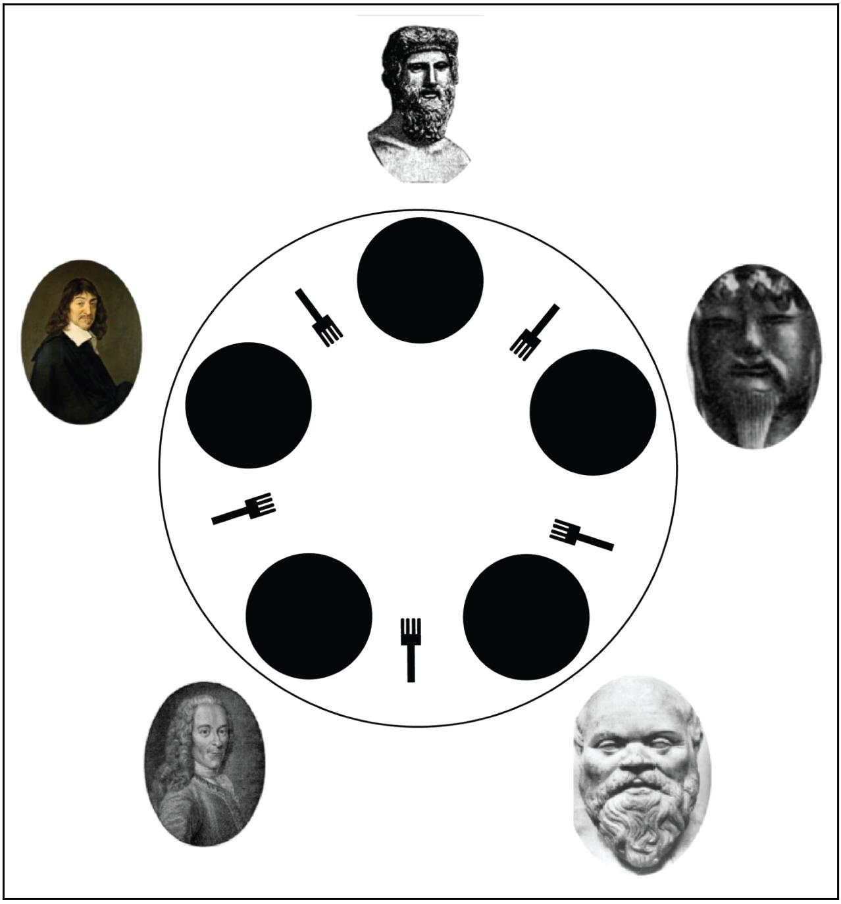

Задача об обедающих философах — классический пример, используемый в информатике для иллюстрации проблем синхронизации при разработке параллельных алгоритмов и техник решения этих проблем.

Задача была сформулирована в 1965 году Эдсгером Дейкстрой как экзаменационное упражнение для студентов.
В качестве примера был взят конкурирующий доступ к ленточному накопителю.
Вскоре задача была сформулирована Энтони Хоаром в том виде, в каком она известна сегодня.

Постановка задачи:
Пять безмолвных философов сидят вокруг круглого стола, перед каждым философом стоит тарелка спагетти.
Вилки лежат на столе между каждой парой ближайших философов.

Каждый философ может либо есть, либо размышлять.
Приём пищи не ограничен количеством оставшихся спагетти — подразумевается бесконечный запас.
Тем не менее, философ может есть только тогда, когда держит две вилки — взятую справа и слева (альтернативная формулировка проблемы подразумевает миски с рисом и палочки для еды вместо тарелок со спагетти и вилок).

Каждый философ может взять ближайшую вилку (если она доступна) или положить — если он уже держит её.
Взятие каждой вилки и возвращение её на стол являются раздельными действиями, которые должны выполняться одно за другим.

Вопрос задачи заключается в том, чтобы разработать модель поведения (параллельный алгоритм), при котором ни один из философов не будет голодать, то есть будет вечно чередовать приём пищи и размышления.